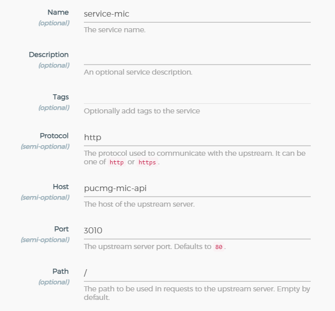
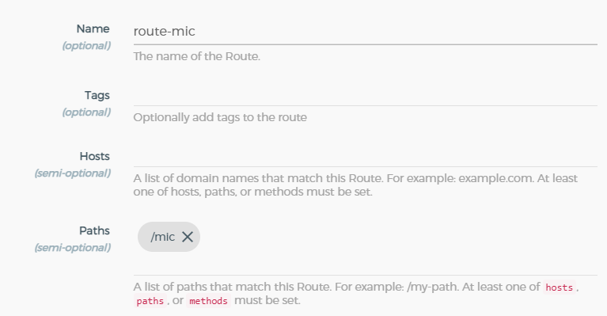

# TCC - ARQUITETURA DE SOFTWARE DISTRIBUÍDO - PUC MINAS
## MIG - Módulo de Integração Geral (API Gateway Kong)

Esse projeto visa criar um módulo de integração geral para integrar todos as diferentes tecnologias e aplicações existentes na empresa, de modo a promover transparência, disponibilidade e robustez para a integração geral.

---

## Alguns conceitos e tecnologias encontradas nesta aplicação

* **API Gateway**
* **Kong**
* **Konga**
* **Postgre**
* **Git**
* **Make**
* **Docker**
* **Docker Compose**

---

## Pré-requisitos
Para rodar esse projeto você precisará ter instalado na sua máquina (host) as seguintes soluções...

* [Docker](https://docs.docker.com/desktop/windows/install/)
* [Make](https://www.gnu.org/software/make/)

---

## Comandos

Você pode executar um comando make no seu terminal desta forma.
> make up

* **up**\
Levanta todas as soluções (containers) desta solução, você pode acessá-los em...
    * **kong** &#8594; localhost:8000
    * **API do kong** &#8594; localhost:8001
    * **konga** &#8594; localhost:1337

* **down**\
Destrói todos os containers levantados nessa solução.

* **ps**\
Lista todos os containers levantados nessa solução.

---
## Configurando novo serviço e rota ao Kong através do Konga!

* Exemplo de como adicionar **um novo serviço** (Konga) ao Kong.

* Exemplo de como adicionar **uma nova rota** (Konga) a um serviço já existente no Kong.

---

## Agradecimentos

Meus agradecimentos ao [Wesley](https://www.linkedin.com/in/wesleywillians/) do canal [Full Cycle](https://www.youtube.com/channel/UCMUoZehUZBhLb8XaTc8TQrA) pelo vídeo contendo instruções sobre como utilizar o Kong + Konga de forma fácil e prática.

Link do vídeo: https://www.youtube.com/watch?v=_2GRXgYswhI